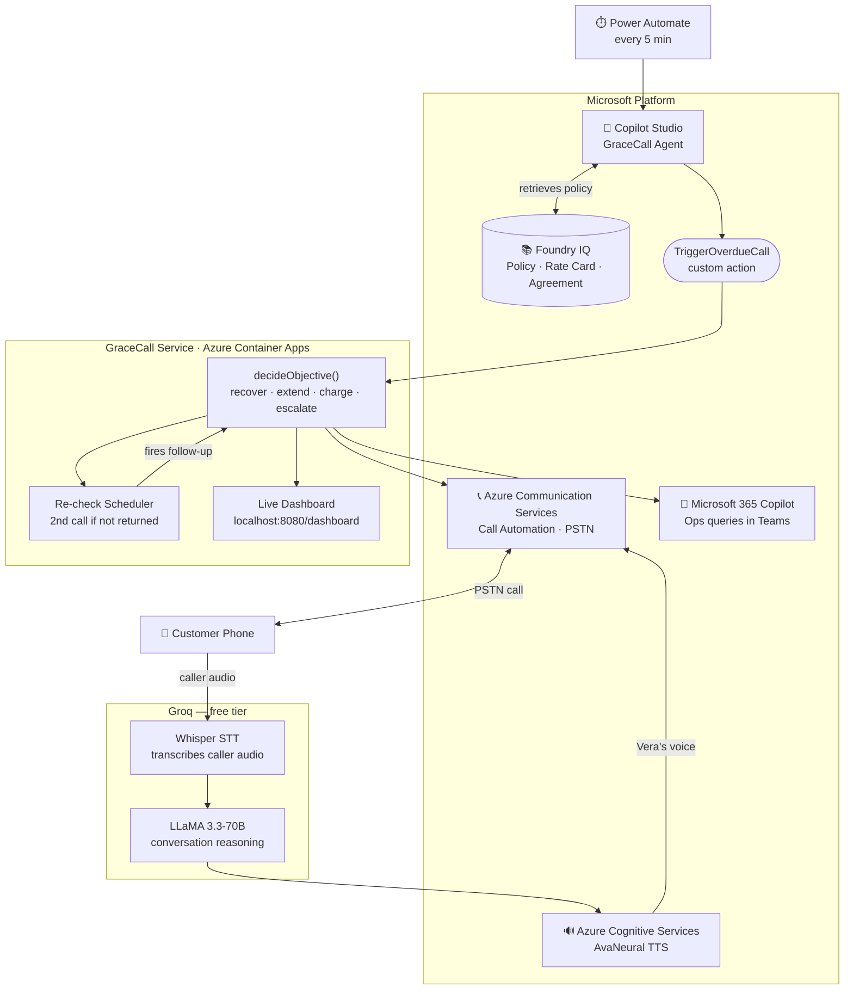

# GraceCall: AI Voice Agent for Rental Car Overage Recovery

> **Microsoft Agents League Hackathon · Enterprise Agents track**

Most agents are chatbots. **GraceCall calls you.** When a rental car goes overdue, Vera (our AI persona) places a
real outbound phone call and works through the recovery (resumes the booking, offers an extension, settles the overage, or escalates) all within policy. If the customer promises to return it, the agent re-checks automatically when promised. No callback, no follow-up email: just a second call if needed.

### Microsoft stack

| Service | Role in GraceCall |
|---|---|
| **Copilot Studio** | Agent authoring: instructions, Foundry IQ knowledge connection, `TriggerOverdueCall` custom action |
| **Azure AI Foundry + Foundry IQ** | Knowledge grounding: overage policy, rate card, rental agreement retrieved per call |
| **Microsoft 365 Copilot** | Ops surface: staff query outcomes ("What did Vera say to Alex?") directly in Teams/M365 |
| **Azure Communication Services** | Call Automation: places the real outbound PSTN call and streams audio |
| **Azure Cognitive Services** | TTS: AvaNeural voice renders Vera's responses naturally |
| **Azure Container Apps** | Hosts the GraceCall backend service (always-on, auto-scaled) |
| **Power Automate** | Scheduled trigger: polls for overdue rentals every 5 minutes and invokes the Copilot Studio agent |

The agent is **authored in Copilot Studio**, grounded by **Foundry IQ**, and surfaced in **Microsoft 365 Copilot**. It places the live call through **Azure Communication Services** Call Automation, with **Azure Cognitive Services** (AvaNeural) for voice output.
For LLM reasoning and STT, it uses **Groq** (free tier: LLaMA 3.3-70B + Whisper) wired into the ACS media stream.



---

## Why it stands out
- **It makes a real phone call:** natural voice (Vera), barge-in, two-way conversation. Unforgettable vs. another chatbot.
- **Full agentic loop, no human callback needed:** logs the return promise, automatically re-checks at the promised time, and places a follow-up call if the car isn't back. True autonomous agent behavior.
- **It reasons, it doesn't script:** the *same* agent **recovers** a booked SUV but **extends** an idle
  economy car, based on the live situation + Foundry IQ policy. (`RNT-1001` vs `RNT-1002`.)
- **Guardrails are enforced in code, not just prompted:** the tools refuse to over-charge or over-extend
  even if the model tries. That's the difference between a demo and something an enterprise trusts.
- **Responsible AI is built in:** discloses it's an AI on every call, honors do-not-call, escalates on
  distress, never takes card numbers by voice, caps charges and attempts.
- **Advanced prompt engineering:** uses Few-Shot + Contrastive CoT, ReAct, ART, Chain-of-Verification, Rephrase-and-Respond, Thread-of-Thought, Take a Step Back, and Emotion Prompting techniques to ground Vera's reasoning.

## How it works: the full agentic loop
1. **Observe:** how late is the car, who's the customer, is another booking waiting, what's demand?
2. **Decide:** `decideObjective()` picks **recover · extend · charge · escalate** within hard policy limits
   sourced from Foundry IQ.
3. **Act:** place the call via Azure ACS; Vera (powered by Groq LLaMA 3.3-70B + Whisper STT, Azure TTS) engages
   the customer. If promised return: log the promised time and start a re-check timer.
4. **Re-check:** at the promised time, automatically verify if the car has been returned.
5. **Follow-up:** if not returned, flag for escalation and place a second call. Vera says "this is a follow-up call."
6. **Confirm:** log all outcomes (call transcripts, decisions, tool actions) in the Foundry agent chat.

---

## Repo layout
| Path | What |
|---|---|
| `src/agent/` | **The brain:** `systemPrompt.ts`, decision `policy.ts`, policy-enforced `tools.ts`. |
| `src/acs/`, `src/groq/` | Azure telephony core: outbound call, media bridge; Groq STT+LLM conversation loop. |
| `src/scheduler.ts` | Optional autonomous dialer that calls overdue rentals by itself. |
| `src/dashboard.ts` | Live demo dashboard (transcript + decisions + tool actions). |
| `src/data/rentals.ts` | In-memory rental seed (prod = Dataverse/Cosmos via Foundry IQ). |

---

## Quick start: run the service
```bash
cp .env.example .env       # fill in values; NEVER commit .env (it's gitignored)
npm install
npm run typecheck          # clean
npm run dev                # starts on :8080
```

**Required environment variables:**
- `GROQ_API_KEY`: Groq API key (enables Whisper STT + LLaMA 3.3-70B LLM)
- `ACS_CONNECTION_STRING` + `ACS_CALLER_ID`: Azure Communication Services (outbound PSTN)
- `AZURE_SPEECH_KEY` + `AZURE_SPEECH_REGION`: Azure Cognitive Services (TTS with AvaNeural)
- `CALLBACK_BASE_URL`: HTTPS URL reachable by ACS (dev tunnel / ngrok)
- `TRIGGER_API_KEY`: shared secret sent by Copilot Studio in `X-GraceCall-Key` header
- `ENABLE_MEDIA_STREAMING=1`: enables two-way conversation
- `AUTO_DIAL=1`: auto-calls overdue rentals every minute
- `RECHECK_AFTER_MIN=2`: for demo (re-check after 2 minutes; production: 60+)

Then expose `:8080` over HTTPS (dev tunnel / ngrok), set `CALLBACK_BASE_URL`, and place a call:
```bash
npm run trigger:demo               # RNT-1001 (recover scenario)
npm run trigger:demo RNT-1002      # extend scenario
```

Watch the full loop live at **`http://localhost:8080/dashboard`**: transcript, re-check countdown, escalation badge, and follow-up call trigger all update in real-time.

## Triggering: manual, automatic, or via Copilot Studio
| Mode | How | For |
|---|---|---|
| Manual (CLI) | `npm run trigger:demo [rentalId]` | quick tests |
| Manual (agent) | In Copilot Studio / M365 Copilot: *"Call Alex Rivera about his overdue SUV"* | the demo |
| Automatic (initial) | `AUTO_DIAL=1` → checks every minute, calls any rental overdue by `AUTO_DIAL_AFTER_MIN` (default 60) | autonomous initial calls |
| Automatic (re-check) | After promised return time: automatically re-checks rental status and triggers follow-up if needed | full agentic loop |

For the video demo, keep `AUTO_DIAL=0` and trigger manually so the call lands on camera. The re-check loop runs independently. Set `RECHECK_AFTER_MIN=2` for a fast demo, `60` for production.

---

## Status: Complete & Ready to Run
The **code is complete and verified** (typecheck clean; decision engine + endpoints tested locally). What
remains is cloud setup that needs your accounts and logins:

**Done (in this repo)**
- Full decision engine with policy-enforced tools
- Dynamic system prompt (Vera's personality + tools + reasoning instructions)
- Azure ACS Call Automation integration (outbound PSTN)
- Groq STT (Whisper) + LLM (LLaMA 3.3-70B) + Azure TTS (AvaNeural) pipeline
- **Full agentic loop:** initial call → promised return logged → auto re-check at promised time → follow-up call if not returned
- Autonomous scheduler with re-check timers
- Live dashboard with escalation badges and countdown timers

**To add (your Azure tenant)**
1. **Buy an outbound ACS phone number** + create ACS resource
2. **Set up Groq API key** (free tier) → add to `.env`
3. **Set up Azure Cognitive Services** for TTS (AvaNeural) → keys into `.env`
4. **Create the Azure AI Foundry agent** (GraceCall-Dispatcher, gpt-oss-120b): paste the system prompt, upload your policy docs as Foundry IQ knowledge sources, and register the `triggerOverdueCall` OpenAPI tool pointing at your deployed server
5. **Record the demo** and submit

---

## Tech stack & how the track requirements are met
| Track requirement | How GraceCall meets it |
|---|---|
| **Authored in Copilot Studio** | GraceCall agent: instructions, Foundry IQ knowledge, `TriggerOverdueCall` custom action |
| **Microsoft IQ layer (Foundry IQ)** | Overage policy, rate card, and rental agreement retrieved per call; every decision is grounded in retrieved knowledge |
| **Microsoft 365 Copilot surface** | Agent published to M365 Copilot; ops staff query outcomes in Teams ("What happened with RNT-1001?") |
| **Real business scenario** | Rental-overage recovery: recover booked vehicles, extend idle ones, settle charges, escalate disputes |
| **Responsible AI** | AI disclosure on first sentence, do-not-call honored, escalates on distress, no card numbers by voice, charge and attempt caps enforced in code |
| **Full agentic autonomy** | Power Automate triggers every 5 min; agent re-checks promised return times and places follow-up calls without human intervention |

**Microsoft services:**
- **Copilot Studio** - agent brain, knowledge, custom action orchestration
- **Azure AI Foundry + Foundry IQ** - model deployment, knowledge grounding
- **Microsoft 365 Copilot** - ops query surface in Teams
- **Azure Communication Services** - outbound PSTN Call Automation
- **Azure Cognitive Services** - AvaNeural TTS
- **Azure Container Apps** - backend hosting
- **Power Automate** - scheduled overdue-rental trigger

**Non-Microsoft (speech processing, free tier):**
- **Groq Whisper** - STT transcription of caller audio
- **Groq LLaMA 3.3-70B** - LLM reasoning for conversation turns

**Backend:** TypeScript · Node/Express · `@azure/communication-call-automation`

## Security
- **Secrets are environment-variable only.** Nothing is hardcoded; `.gitignore` blocks `.env`. Only
  `.env.example` (placeholders) is committed.
- All phone numbers and customer records in the seed data are **fictional**; the brand "Horizon Car
  Rental" is a placeholder.

## License
MIT. See [`LICENSE`](LICENSE). Original work for the Microsoft Agents League Hackathon.
