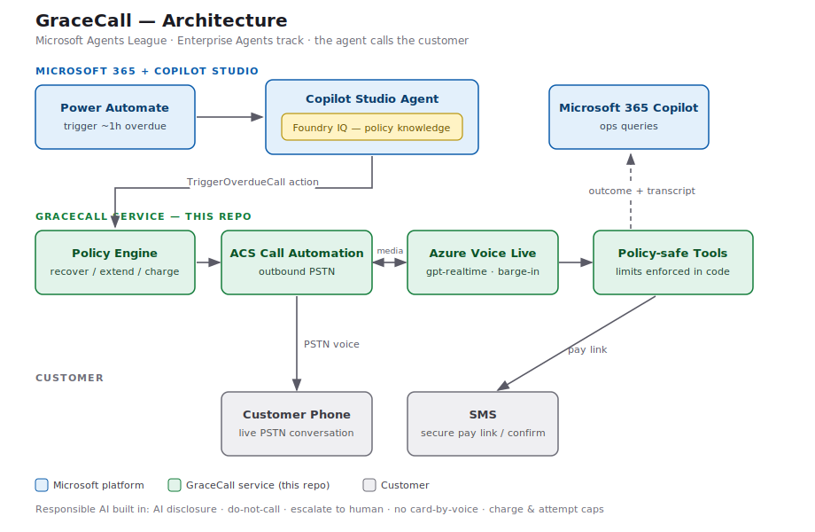

# GraceCall — an AI voice agent that calls customers about overdue rentals

> **Microsoft Agents League Hackathon · Enterprise Agents track**

Most agents are chatbots. **GraceCall calls you.** When a rental car goes overdue, GraceCall places a
real outbound phone call about an hour later and resolves it — recovers the vehicle for the next
booking, offers an extension, settles the overage, or hands off to a human — all within policy.

The agent is **authored in Copilot Studio**, grounded by **Foundry IQ**, surfaced in **Microsoft 365
Copilot**, and places the live call through an **Azure** service (Communication Services Call Automation
+ Azure Voice Live).

```
Trigger (~1h overdue)
  → Copilot Studio agent  +  Foundry IQ (overage policy · rate card · agreement)
  → decides: recover | extend | charge | escalate
  → TriggerOverdueCall action → Azure: ACS Call Automation (outbound PSTN) ⇄ Voice Live (gpt-realtime)
  → 📞 the customer's phone — a live, policy-safe conversation
  → outcome + transcript → Microsoft 365 Copilot (ops ask "what happened on RNT-1001?")
```



---

## Why it stands out
- **It makes a real phone call** — barge-in, natural voice, in the demo. Unforgettable vs. another chatbot.
- **It reasons, it doesn't script** — the *same* agent **recovers** a booked SUV but **extends** an idle
  economy car, based on the live situation + Foundry IQ policy. (`RNT-1001` vs `RNT-1002`.)
- **Guardrails are enforced in code, not just prompted** — the tools refuse to over-charge or over-extend
  even if the model tries. That's the difference between a demo and something an enterprise trusts.
- **Responsible AI is built in** — discloses it's an AI on every call, honors do-not-call, escalates on
  distress, never takes card numbers by voice, caps charges and attempts.

## How it works — the reasoning loop
1. **Observe** — how late is the car, who's the customer, is another booking waiting, what's demand?
2. **Decide** — `decideObjective()` picks **recover · extend · charge · escalate** within hard policy limits
   sourced from Foundry IQ.
3. **Act** — place the call; during it the model calls tools, each re-validated against the limits.
4. **Confirm** — log the outcome; ops query it from Microsoft 365 Copilot.

Full design: [`docs/architecture.md`](docs/architecture.md) · Project description for the submission form:
[`SUBMISSION.md`](SUBMISSION.md) · 5-minute demo plan: [`docs/demo-script.md`](docs/demo-script.md).

---

## Repo layout
| Path | What |
|---|---|
| `src/agent/` | **The brain** — `systemPrompt.ts`, decision `policy.ts`, policy-enforced `tools.ts`. |
| `src/acs/`, `src/voicelive/` | Azure telephony core — outbound call, Voice Live session, media bridge. |
| `src/scheduler.ts` | Optional autonomous dialer — calls overdue rentals by itself. |
| `src/dashboard.ts` | Live demo dashboard (transcript + decisions + tool actions). |
| `src/data/rentals.ts` | In-memory rental seed (prod = Dataverse/Cosmos via Foundry IQ). |
| `knowledge/` | Overage policy · rate card · sample agreement — the **Foundry IQ** knowledge source. |
| `copilot-studio/` | `SETUP.md`, agent instructions, and `openapi.yaml` (the custom connector). |
| `docs/` | Architecture (`.md` + `.svg`), `CALL-SETUP.md`, and the demo script. |

---

## Quick start — run the Azure service
```bash
cp .env.example .env       # fill in values; NEVER commit .env (it's gitignored)
npm install
npm run typecheck          # clean
npm run dev                # starts on :8080
```
Then expose `:8080` over HTTPS (dev tunnel / ngrok), set `CALLBACK_BASE_URL`, and place a call:
```bash
npm run trigger:demo               # RNT-1001 (recover scenario)
npm run trigger:demo RNT-1002      # extend scenario
```
**Two stages:** with `ENABLE_MEDIA_STREAMING=0` the phone rings and speaks a fixed AI-disclosure line
(no Voice Live needed — great first test). With `ENABLE_MEDIA_STREAMING=1` Voice Live runs the full
two-way conversation. Step-by-step (buy number → ring → talk): **[`docs/CALL-SETUP.md`](docs/CALL-SETUP.md)**.

Watch a call live at **`http://localhost:8080/dashboard`**.

## Triggering — manual or automatic
| Mode | How | For |
|---|---|---|
| Manual (CLI) | `npm run trigger:demo [rentalId]` | quick tests |
| Manual (agent) | In Copilot Studio / M365 Copilot: *"Call the customer for RNT-1001"* | the demo |
| Automatic | `AUTO_DIAL=1` → checks every minute, calls any rental overdue by `AUTO_DIAL_AFTER_MIN` (default 60) | the autonomous "calls them ~1h late by itself" behavior |

You set the rule once — the agent decides *when*. For the video, keep `AUTO_DIAL=0` and trigger manually so
the call lands on camera.

---

## ✅ What's done · 🔧 what the team adds
The **code is complete and verified** (typecheck clean; decision engine + endpoints tested locally). What
remains is cloud setup that needs your accounts and logins:

**Done (in this repo)**
- Decision engine, policy-enforced tools, dynamic system prompt
- Azure call path: outbound PSTN, Voice Live session, 24kHz media bridge with barge-in
- Autonomous scheduler, live dashboard, the `TriggerOverdueCall` connector spec, Foundry IQ knowledge docs

**To add (your Azure / Microsoft 365 tenant)**
1. **Buy an outbound ACS phone number** + create the ACS resource → [`docs/CALL-SETUP.md`](docs/CALL-SETUP.md)
2. **Create the Azure Voice Live resource** (North-America region) → keys into `.env`
3. **Build the Copilot Studio agent** + connect **Foundry IQ** over `knowledge/` + import `openapi.yaml`
   as the action → [`copilot-studio/SETUP.md`](copilot-studio/SETUP.md)
4. **Publish to Microsoft 365 Copilot**
5. **Record the demo** ([`docs/demo-script.md`](docs/demo-script.md)) and submit

---

## Tech stack & how the track requirements are met
| Requirement | Met by |
|---|---|
| Authored in **Copilot Studio** | The agent, instructions, knowledge, and `TriggerOverdueCall` action |
| **Microsoft IQ layer** | **Foundry IQ** grounds every decision; demoable with a cited answer |
| **Microsoft 365 Copilot** | Agent published there; outcomes queryable by ops |
| Real business scenario + Responsible AI | Rental-overage recovery; disclosure, do-not-call, escalation, no card-by-voice, charge & attempt caps |

Built with: TypeScript · Node/Express · `@azure/communication-call-automation` · `ws` · Azure Voice Live
(gpt-realtime). Audio is 24kHz PCM end-to-end — matches Voice Live, so no resampling. The ACS↔Voice Live
media framing follows [Azure-Samples/call-center-voice-agent-accelerator](https://github.com/Azure-Samples/call-center-voice-agent-accelerator).

## Security
- **Secrets are environment-variable only.** Nothing is hardcoded; `.gitignore` blocks `.env`. Only
  `.env.example` (placeholders) is committed.
- All phone numbers and customer records in the seed data are **fictional**; the brand "Horizon Car
  Rental" is a placeholder.

## License
MIT — see [`LICENSE`](LICENSE). Original work for the Microsoft Agents League Hackathon.
