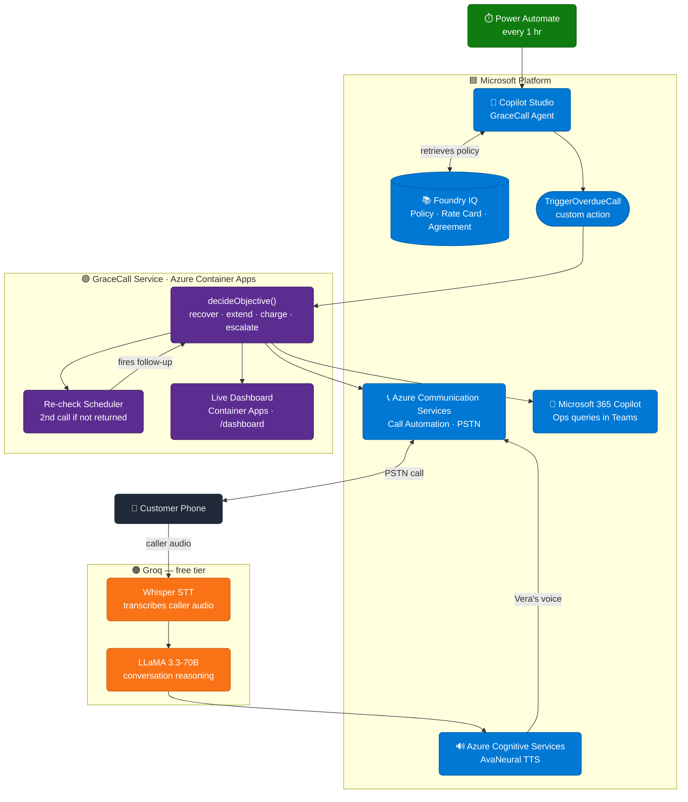

# GraceCall

> **Microsoft Agents League Hackathon · Enterprise Agents track**

**Most agents are chatbots. GraceCall calls you.**

A rental car goes overdue. No staff involved. GraceCall detects it, dials the customer, holds a real two-way conversation, and if they promise to return it — re-checks automatically and calls again if they don't. Every decision within policy. Every call logged.

---



---

## Why it's different

- **It makes a real phone call.** Not a notification. Not a chat. An actual PSTN call with a natural voice (Vera), barge-in, and two-way conversation.
- **It reasons, not scripts.** Same agent, two rentals, opposite decisions — booked SUV gets a recovery call, idle economy car gets an extension offer. Driven by live data + Foundry IQ policy.
- **Fully autonomous loop.** Detects overdue → calls → logs promise → re-checks → calls again if needed. Zero human involvement.
- **Guardrails in code, not just prompts.** Tools reject over-charges and over-extensions even if the model tries. Enterprise-grade, not demo-grade.
- **Responsible AI built in.** AI disclosure on sentence one. Do-not-call honored. No card numbers by voice. Escalates on distress. Attempt caps enforced.

---

## Microsoft stack

| Service | Role |
|---|---|
| **Copilot Studio** | Agent brain — instructions, Foundry IQ knowledge, `TriggerOverdueCall` action |
| **Azure AI Foundry + Foundry IQ** | Grounds every decision in retrieved policy, rate card, and rental agreement |
| **Microsoft 365 Copilot** | Ops surface — staff ask "What did Vera say to Alex?" directly in Teams |
| **Azure Communication Services** | Places the real outbound PSTN call and streams audio |
| **Azure Cognitive Services** | AvaNeural TTS renders Vera's voice |
| **Azure Container Apps** | Hosts the backend (always-on) |
| **Power Automate** | Polls for overdue rentals every hour, no human trigger needed |

---

## Track requirements

| Criterion | How GraceCall meets it |
|---|---|
| Authored in Copilot Studio | Agent instructions + Foundry IQ knowledge + `TriggerOverdueCall` custom action — see `copilot-studio/` |
| Microsoft IQ layer | Foundry IQ knowledge retrieved per call; decisions cite the policy |
| M365 Copilot surface | Agent published to Teams; outcomes queryable by ops |
| Real business scenario | Rental-overage recovery with real decisions and real calls |
| Responsible AI | Disclosure, do-not-call, no card-by-voice, escalation, caps — enforced in code |
| Full agentic autonomy | End-to-end loop: detect → call → re-check → follow-up, no human in the loop |

---

## Works across industries

Same architecture. Swap the Foundry IQ knowledge and policy file. No code changes.

| Condition detected | Agent action |
|---|---|
| Car rental overdue | Calls customer, negotiates return or extension, re-checks at promised time |
| Hotel checkout missed | Calls guest, offers late checkout, follows up if room not vacated |
| Appointment no-show | Calls patient, reschedules within policy, flags to care team |
| Equipment not returned | Calls site contact, arranges return, escalates if no response |
| Payment missed | Calls customer, confirms plan within policy, logs commitment |
| Delivery window missed | Calls recipient, reschedules, updates dispatch automatically |

---

## Built on Azure Student Subscription

No paid credits. Real constraints, real workarounds.

| Constraint | Solution |
|---|---|
| Azure Voice Live not available on student tier | Bridged ACS audio stream to **Groq Whisper + LLaMA** over WebSocket at 24kHz PCM — no resampling |
| No static HTTPS URL | **ngrok** tunnel; `CALLBACK_BASE_URL` in `.env` |
| Global Standard model (no realtime tier) | Fine for orchestration; latency-sensitive conversation runs on Groq |
| Hard spending caps | `AUTO_DIAL=0` default; re-check is opt-in; dashboard gives manual control |
| ACS number provisioning | Successfully provisioned a real outbound number on the student subscription |

---

## Run it

```bash
cp .env.example .env   # fill in keys
npm install
npm run dev            # :8080
```

Key env vars: `ACS_CONNECTION_STRING`, `ACS_CALLER_ID`, `GROQ_API_KEY`, `AZURE_SPEECH_KEY`, `CALLBACK_BASE_URL`, `TRIGGER_API_KEY`

```bash
npm run trigger:demo          # place a call for RNT-1001
npm run trigger:demo RNT-1002 # extend scenario
```

The live dashboard at **`https://grace-call.greenplant-d2f64cf8.eastus.azurecontainerapps.io/dashboard`** surfaces the full agentic loop in real-time: call transcript, decision objective, escalation status, re-check countdown, and follow-up trigger — updating as Vera conducts the conversation.

---

## License

MIT. Original work for the Microsoft Agents League Hackathon.
