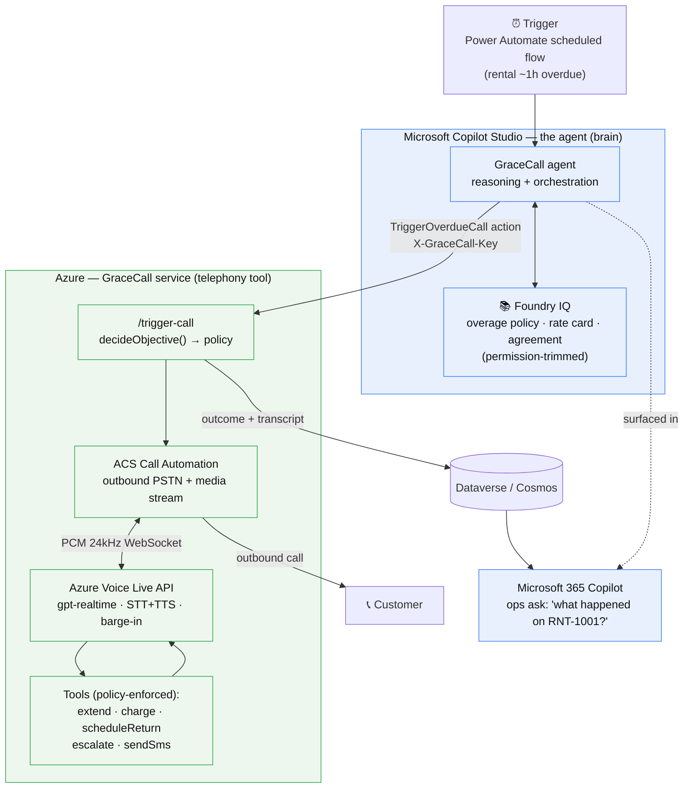

# GraceCall — Architecture

The Copilot Studio agent is the **brain** (reasoning + knowledge + orchestration). The live phone
call is a **tool** it invokes — an Azure service (ACS Call Automation + Voice Live). This separation
is what makes it a credible enterprise design and satisfies "authored in Copilot Studio."

## The reasoning loop (scores the 20% reasoning criterion)
1. **Observe** — pull the rental + policy from Foundry IQ: how late, customer tier, upcoming booking, demand.
2. **Decide** — `decideObjective()` picks **recover | extend | charge | escalate** within hard policy limits.
3. **Act** — place the call; during it the model uses tools, each re-validated against the limits.
4. **Confirm** — log the outcome to Dataverse; ops query it from M365 Copilot.

## Why each Microsoft requirement is met
- **Authored in Copilot Studio** — the agent, its instructions, knowledge, and the action live in Copilot Studio.
- **Microsoft IQ layer** — Foundry IQ grounds every decision and is demoable with a cited answer.
- **Microsoft 365 Copilot** — the agent is published there; outcomes are queryable by ops.
- **Responsible AI** — AI self-disclosure + recording notice on every call; do-not-call, opt-out, escalation,
  no card capture by voice, auto-charge ceiling, 3-attempt cap.

> A rendered version of this diagram is in [`architecture.svg`](architecture.svg) — use it in the demo video and the submission.
