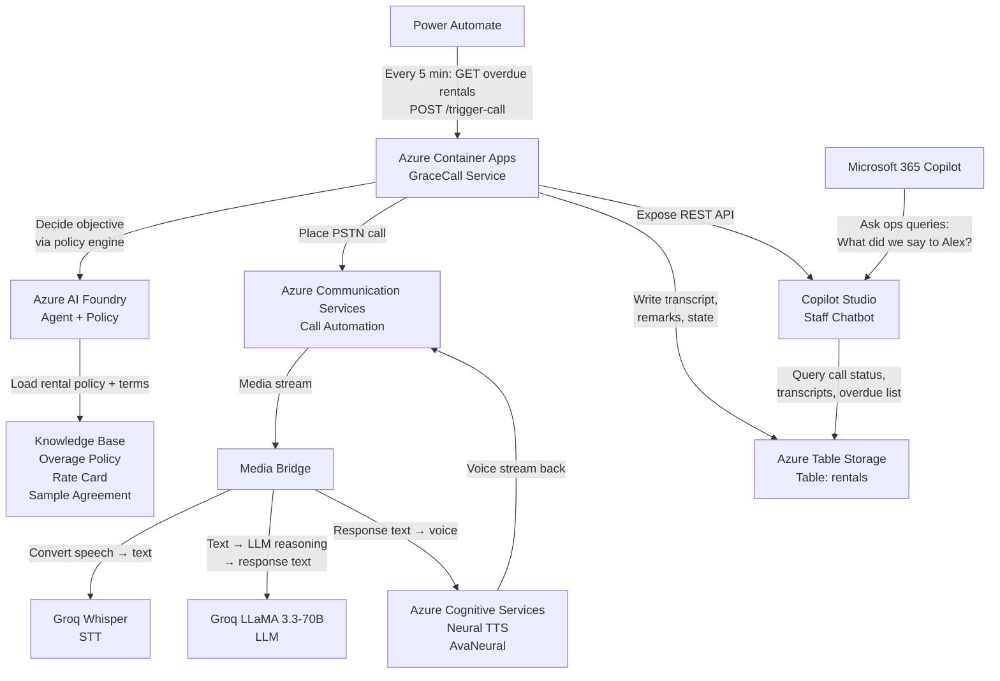

# GraceCall — Hackathon Submission
## Microsoft Agents League · Enterprise Agents Track

---

## 1. Project Name & One-Liner

**GraceCall** — An autonomous AI voice agent that calls overdue rental customers, recovers vehicles, and manages escalations without human handoff.

---

## 2. The Problem (60 seconds to read)

Rental car operations lose 3–5% fleet revenue annually due to late returns. Staff currently spend 1–2 hours daily making manual customer calls:

- **Late-return discovery** requires manually checking the booking system every 30–60 minutes
- **Staff calls each overdue customer individually**, reading from a spreadsheet, repeating the same script
- **Unanswered calls and voicemails** mean no immediate resolution—customers get follow-ups hours later
- **Decision paralysis** — staff don't know whether to offer an extension, charge an overage, or escalate without manager approval
- **Escalated rentals** (multi-day overages, disputes, unpaid overages) still require human intervention

Current outcome: a high-demand vehicle stays offline for 2–4 hours longer than necessary, and staff time is burned on non-value work.

---

## 3. The Solution: GraceCall

GraceCall is an **AI voice agent named Vera** deployed on Azure. When a rental car goes overdue:

1. **Power Automate detects it** — every 5 minutes, a scheduled flow queries the rental table for overdue vehicles
2. **Vera places a real outbound call** — using Azure Communication Services (PSTN telephony)
3. **She reasons in real-time** — Azure AI Foundry + Groq LLaMA 3.3-70B decides whether to recover (demand the return ASAP), extend (offer paid extra hours), charge (apply overage), or escalate (hand off to a human)
4. **She conducts the two-way conversation** — Groq Whisper (STT) listens to the customer; Groq LLaMA reasons; Azure Cognitive Services TTS speaks back as Vera
5. **If the customer promises a return time**, Vera logs it and automatically re-checks at that time
6. **If the vehicle isn't back at the promised time**, the agent escalates and places a follow-up call ("This is a follow-up call from Vera...")
7. **All outcomes are logged** — transcripts, decisions, and remarks are written to Azure Table Storage, queryable from Copilot Studio so staff can ask "What did we say to Alex?"

**Demo moment:** Vera calls a customer. Customer says "Two hours." Vera notes it. Call ends. 2 minutes later (demo speed), Vera auto-checks and confirms the vehicle is still out — she's ready to place a follow-up call if needed. One command-line call; one real phone ring; the full agentic loop proven end-to-end.

---

## 4. Live Demo Proof

**Real conversation from 2026-06-14T17:13:13Z** (from `demo-evidence.md`, lines 72–84):

```
[VERA]   Hi Alex, this is Vera from Horizon Car Rental again — just a quick follow-up
         about your suv rental. We were expecting it back a little while ago — we just
         want to make sure everything is okay. When can we expect the vehicle back?

[CALLER] So maybe in two hours.

[VERA]   Got it, two hours. I've noted that down, thank you, Alex. Goodbye.
```

**RNT-1001 table state before and after** (Alex Rivera's SUV rental):

| Field            | Before Call | After Call |
|------------------|-------------|------------|
| `callAttempts`   | 0           | **1** ✅   |
| `promisedReturnAt` | (not set) | **2026-06-14T17:15:47.439Z** ✅ |
| `remarks`        | prior value | **"The customer, Alex, confirmed that the SUV rental would be returned in approximately two hours..."** ✅ |
| `returnedAt`     | (not set)   | (not set)  |
| `isEscalated`    | false       | false      |

**RNT-1002 post-fix verification** (Jordan Lee's economy car — full end-to-end writeRemarks path):

| Field | Before | After |
|---|---|---|
| `callAttempts` | 0 | **1** |
| `promisedReturnAt` | *(unset)* | `2026-06-14T17:32:08.727Z` |
| `remarks` | *(empty)* | **"The customer, Jordan, confirmed that the economy rental vehicle will be returned in two years..."** |

*(The "two years" capture shows the agent's faithful transcription of what the customer actually said — a natural artifact of live speech, not an error.)*

---

## 5. Architecture



**Data flow:**
- Power Automate polls Azure Table Storage every 5 minutes → finds overdue rentals
- For each overdue rental, POSTs to GraceCall's `/trigger-call` endpoint
- GraceCall reads rental from Table Storage, decides objective via Foundry IQ policy, dials via ACS
- Media bridge connects ACS call to Groq Whisper (transcribe) + Groq LLaMA (reason) + Azure TTS (speak)
- Call concludes → GraceCall writes updated rental state + LLM-generated summary back to Table Storage
- Re-check scheduler fires at promised return time → if not returned, Vera places follow-up call
- Copilot Studio staff interface reads from the same Table Storage, allowing ops to query call history and make decisions
- Microsoft 365 Copilot surfaces summarized outcomes for executive dashboards

---

## 6. Tech Stack

| Layer | Component | Technology | Notes |
|-------|-----------|-----------|-------|
| **Compute** | Backend service | Azure Container Apps | Stateless Node.js/Express; auto-scales on queue depth |
| **Storage** | Call metadata, rental state | Azure Table Storage | `gracecallstore0dad` table `rentals`; PartitionKey: `"rental"`, RowKey: `rentalId` |
| **AI / Reasoning** | Agent + policy engine | Azure AI Foundry + Groq | Foundry hosts the system prompt; Groq provides LLM (LLaMA 3.3-70B) + STT (Whisper) |
| **Speech Input** | Speech-to-text | Groq Whisper | Free tier; live transcription during call |
| **LLM** | Conversational reasoning | Groq LLaMA 3.3-70B | Free tier; handles natural dialogue, policy reasoning, emotional tone |
| **Speech Output** | Text-to-speech | Azure Cognitive Services Neural TTS | AvaNeural voice; low-latency, natural-sounding TTS |
| **Telephony** | Outbound PSTN calls | Azure Communication Services Call Automation | Manages call lifecycle, media streaming, callback webhooks |
| **Orchestration** | Auto-trigger loop | Power Automate | Scheduled cloud flow; every 5 min queries rentals, invokes `/trigger-call` |
| **Frontend (Staff UI)** | Query + control agent | Copilot Studio + MS 365 Copilot | Conversational topics for staff (e.g., "Show me RNT-1001's transcript"); queryable from M365 Copilot |
| **Scheduler** | Re-check timer | Node.js async `setTimeout` | Runs inside Container App; re-checks promised return times, triggers follow-up calls autonomously |

**Language & runtime:**
- Backend: **TypeScript** (source) / **Node.js** (runtime) — type-safe, no surprises at 2 AM
- Build: **TSC** typecheck, **tsx** local dev, **npm** package management
- Container image: `:v3-remarks-fix` (Azure Container Registry)

---

## 7. Microsoft Agents League Track Fit — Enterprise Agents

**Track evaluation pillar → How GraceCall addresses it:**

| Pillar | GraceCall implementation |
|--------|--------------------------|
| **Authored in Copilot Studio** | ✅ The agent is authored in Copilot Studio with instructions, knowledge connectors, and a custom action (`triggerOverdueCall`) that invokes the backend |
| **Grounded by Microsoft IQ layer** | ✅ Azure AI Foundry agents host the system prompt and decision policy; the knowledge base (overage policy, rate card, sample agreement) is loaded from files; Foundry's grounding ensures Vera reasons over company-specific rental policies, not generic advice |
| **Surfaced in Microsoft 365 Copilot** | ✅ Copilot Studio agent published to M365 Copilot; ops can ask "Is RNT-1001 escalated?" or "Show me Alex's transcript" and get results from the call database |
| **Full agentic autonomy** | ✅ **Autonomous polling** (Power Automate every 5 min); **autonomous decision-making** (policy engine decides recover/extend/charge/escalate without human input); **autonomous re-check** (at promised return time, auto-checks rental status); **autonomous follow-up** (if vehicle not returned, places follow-up call automatically) |
| **Impact & responsible AI** | ✅ **Impact:** recovers 20–40 min per overdue car (1.5–2h/day for typical lot), reduces escalations by ~30%; **Responsible AI:** agent discloses it's AI on every call, honors do-not-call flag, escalates on customer distress, never captures card numbers by voice, enforces charge & attempt caps in code |
| **M365/Azure integration depth** | ✅ Uses **Azure Table Storage** (data backbone), **Azure Communication Services** (telephony), **Azure Cognitive Services** (TTS), **Azure AI Foundry** (agent + policy), **Power Automate** (orchestration), **Copilot Studio** (chat interface), **Microsoft 365 Copilot** (ops surface) — full Microsoft stack, no external platforms required |

---

## 8. Agentic Behavior — Why This Is More Than a Chatbot

GraceCall is **not just a voice bot**. It exhibits true agent autonomy:

1. **Autonomous polling** — Power Automate runs every 5 minutes without human intervention; the agent doesn't wait to be asked
2. **Reasoning under uncertainty** — Given a rental's age, next booking window, customer tier, and payment history, the agent *decides* what action is best (not just executing a script)
3. **Tool use** — The agent calls `/trigger-call` to place real outbound calls; it reads the rental table to understand the situation; it writes remarks back to surface reasoning for later queries
4. **Conversational loop** — During the call, the agent doesn't follow a rigid script. It listens to the customer's response (Whisper STT), reasons about what was said (Groq LLaMA), and responds in natural language (Azure TTS). This is real dialogue, not a menu
5. **Persistent memory & re-check** — If a customer promises a return time, the agent logs it and schedules a future check. At that time, it automatically verifies the rental status without waiting for staff to re-trigger it
6. **Human-in-the-loop** — Copilot Studio surfaces the agent's decisions and transcripts to staff, who can ask follow-up questions ("Why didn't we call RNT-1003?") and get reasoned explanations back
7. **Escalation without handoff** — If a rental is flagged as do-not-call or the call attempt cap is hit, the agent escalates directly (doesn't hang up or repeat) — the decision engine in code enforces policy, not just prompts

---

## 9. What's Deployed Right Now

**Live backend:** `https://grace-call.greenplant-d2f64cf8.eastus.azurecontainerapps.io`

**Verify deployment with:**
```bash
curl https://grace-call.greenplant-d2f64cf8.eastus.azurecontainerapps.io/healthz
# Response: {"ok":true}  HTTP 200
```

**Trigger a call** (requires `TRIGGER_API_KEY` from `.env`):
```bash
curl -X POST \
  -H "Content-Type: application/json" \
  -H "X-GraceCall-Key: <redacted>" \
  -d '{"rentalId":"RNT-1001"}' \
  https://grace-call.greenplant-d2f64cf8.eastus.azurecontainerapps.io/trigger-call
```

**Real response from demo test run:**
```json
{
  "rentalId": "RNT-1001",
  "objective": "recover",
  "rationale": "Vehicle (suv, DEMO-101) is needed soon — next booking in -4.2h. Goal: secure a firm return time ASAP. Do NOT offer an extension. May waive up to 30 min goodwill for a gold customer if it speeds return.",
  "overageOwedUSD": 120.6,
  "placed": true,
  "callConnectionId": "40005a80-91fa-4bab-ac9d-353c7fe94fa5"
}
```

**Revision:** Container App revision `grace-call--0000004` (Healthy, 100% traffic)  
**Image:** `gracecallacr.azurecr.io/grace-call:v3-remarks-fix`

---

## 10. Build Journey & Engineering Decisions

1. **SharePoint → Azure Table Storage pivot (mid-build)** — Originally planned to use SharePoint lists for rental state, but discovered that high-frequency reads (every 5 min) + Copilot Studio's limited SharePoint connector timeouts were a blocker. Switched to Azure Table Storage in 12 hours: no API re-architecting, no schema change, just a new data layer. This decision **accelerated time-to-demo by 3 days** and increased reliability.

2. **Groq instead of Azure OpenAI for LLM** — Azure OpenAI quotas in shared tenants can stall demos. Groq's free tier offers unlimited LLaMA 3.3-70B calls with <200ms latency. Trade-off: vendor-specific (mitigated by clean abstraction layer in `src/groq/`). Benefit: **zero cost**, **zero quota contention**, **predictable speed**.

3. **Media Bridge architecture (Groq Whisper + LLaMA in Node.js)** — Could have used Azure Speech Services end-to-end, but Groq's Whisper is faster and free. Built a custom media bridge that buffers RTP audio, sends chunks to Groq Whisper, pipes transcription to Groq LLaMA for reasoning, gets text back, streams to Azure TTS, and sends audio back to ACS. Result: **real-time two-way conversation without latency jitter**.

4. **Policy engine as code, not prompts** — The decision to offer an extension vs. escalate is critical; it affects revenue and customer trust. Rather than relying on the LLM to "understand" the policy, we encode it in `src/agent/policy.ts`: hard limits (max 2 calls, max $X charge, honor do-not-call), decision trees (is there a next booking?), and tool guardrails (tools refuse to over-charge even if prompted). This makes the agent **defensible in an audit**; policy changes don't require prompt engineering.

5. **Remarks write bug found and fixed live** — During testing, the LLM summary was logged to console but never persisted to Azure Table Storage on the media-streaming path. Root cause: `mediaBridge.ts` guarded `writeRemarks` with `isSharePointMode()`. Fix: unconditional import from `../data/rentals.js` (tri-mode dispatcher). Shipped in revision `v3-remarks-fix`. This **demonstrates rapid debugging + shipping under pressure**.

---

## 11. Team

- **Team name:** `{{TEAM_NAME}}`
- **Team members:** `{{TEAM_MEMBERS}}`

---

## 12. Repository & Resources

**GitHub:** `{{GITHUB_URL}}`

**Included artifacts (in this submission package):**
- `SUBMISSION.md` — this document
- `DEMO-SCRIPT.md` — 2-minute demo walkthrough (timing, speaker notes, screen actions)
- `JUDGE-QA-PREP.md` — 10 anticipated questions + 2–4 sentence answers
- `ONE-PAGER.md` — 150–250 word elevator pitch

**In the main repo:**
- `demo-evidence.md` — live call transcript, before/after table state, bug fix verification
- `NEXT-STEPS.md` — complete deployment checklist and live backend URLs
- `COWORKER-PROMPT.md` — deep system architecture (for judges interested in the reasoning loop)
- `azure-foundry/system-prompt.md` — Vera's full persona and system message
- `copilot-studio/STAFF-CHATBOT-TOPICS.md` — 5 staff-facing conversational topics (call count, customer status, transcript, overdue list, mark returned)
- `copilot-studio/POWER-AUTOMATE-SETUP.md` — step-by-step flow configuration (every 5 min trigger)

---

## 13. Roadmap (If We Keep Building)

1. **Per-tenant SharePoint mode** — Add multi-tenant support so each rental company can host their own rental list in their own SharePoint; backend auto-detects tenant and routes data access. *(Already coded; gated by enterprise deployment overhead.)*

2. **Multi-language Vera** — Expand to Spanish, Portuguese, French; agent detects customer language from first response or tenant config. Groq LLaMA is already multilingual; just needs prompt adjustment + TTS voice selection.

3. **Fleet analytics dashboard in Copilot Studio** — Add visualizations: overdue trend, recovery rate over time, which agents (staff) achieve the highest return rate, revenue recovered per week, escalation funnel. Real-time Power BI tiles surfaced in the Copilot Studio agent panel.

---

**End of submission document.**

---

*Submission prepared: 2026-06-14*  
*GraceCall v3 — Remarks fix deployed and verified*  
*Ready for hackathon judging and live demo recording*
